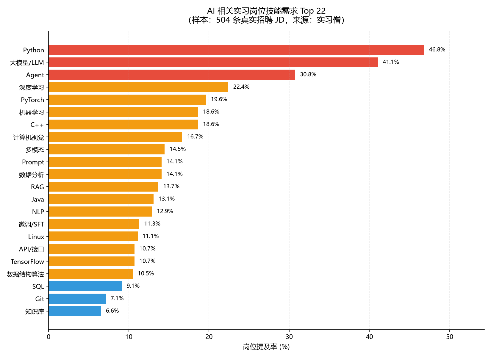
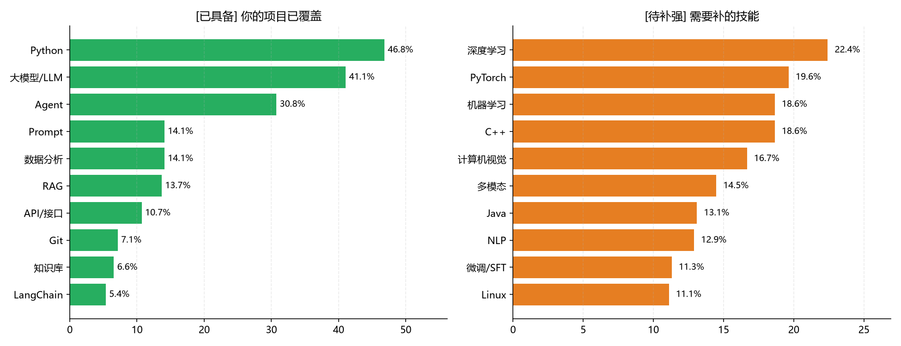
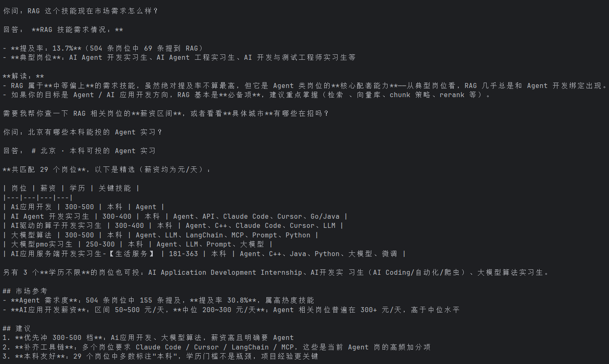
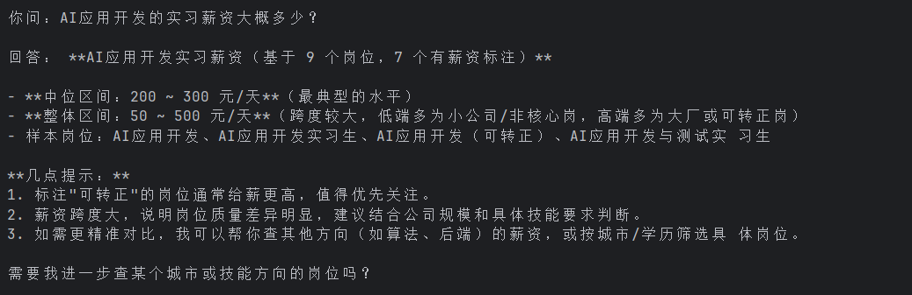
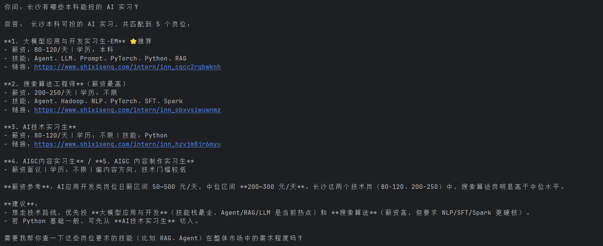

# AI 求职辅助 Agent

基于 **LangChain 1.x `create_agent`** 构建的求职分析智能体（ReAct 范式），
使用 `@tool` 封装三个工具，帮助求职者分析 AI / 大模型 / Agent 方向的实习岗位市场。

**数据来源**：自采 **504 条**真实 AI 相关实习岗位 JD（实习僧，全国）

## 项目背景              

准备 AI 方向实习时，我遇到两个具体问题：
1. 招聘信息分散 —— JD 散落在各个平台，很难判断"市场到底要什么技能"
2. 查询成本高 —— 想查薪资、查岗位，每次都要手动翻招聘软件

所以我做了这个 Agent：用数据回答"市场要什么"，用工具回答"我该投哪里"

## 核心功能

| 工具 | 作用 |
|---|---|
| `query_skill(skill)` | 查询某项技能在 AI 岗位中的需求程度（提及率、岗位数、典型岗位） |
| `query_salary(job_keyword)` | 按岗位关键词统计薪资区间（日薪中位数） |
| `search_jobs(city, education, skill, limit)` | 按城市 / 学历 / 技能检索具体岗位，返回可投递链接 |

Agent 会自主决定调用哪个工具、按什么顺序调用，并基于**真实数据**作答。

## 技术栈

**运行依赖**（见 `requirements.txt`）：

| 组件 | 选型 |
|---|---|
| Agent 框架 | LangChain 1.x `create_agent`（ReAct） |
| 大语言模型 | DeepSeek-chat |
| 工具封装 | `@tool` 装饰器 |
| 数据处理 | Python 标准库 `json` |

**数据准备**（离线执行一次，产物已提交，非运行依赖）：

| 组件 | 用途 |
|---|---|
| pandas | 岗位数据清洗与统计 |
| Matplotlib | 技能词频可视化 |

## 数据层

项目的数据来自一次完整的岗位采集与分析：

```
采集 1072 条岗位 → 过滤技术岗 → 504 条 AI 相关岗位
        ↓
抓取岗位详情页（含字体加密破解）
        ↓
提取技能关键词 → 技能需求词频表 → skill_kb.json
```

**技能需求 Top 10（504 条 JD）：**

| 排名 | 技能 | 提及率 |
|---|---|---|
| 1 | Python | 46.8% |
| 2 | 大模型 / LLM | 41.1% |
| 3 | Agent | 30.8% |
| 4 | 深度学习 | 22.4% |
| 5 | PyTorch | 19.6% |
| 6 | 机器学习 | 18.7% |
| 7 | C++ | 18.7% |
| 8 | 计算机视觉 | 16.7% |
| 9 | 多模态 | 14.5% |
| 10 | Prompt | 14.1% |



**你的技能 vs 市场缺口：**



## 快速开始

```bash
# 1. 安装依赖
pip install -r requirements.txt

# 2. 配置环境变量
cp .env.example .env
# 编辑 .env，填入你的 DEEPSEEK_API_KEY

# 3. 先跑工具自检（不需要大模型）
python job_agent.py --test

# 4. 启动 Agent
python job_agent.py
```

## 使用示例

**技能需求查询：**



**薪资区间查询：**



**岗位检索（含真实投递链接）：**



## 项目结构

```
job_agent/
├── job_agent.py            # 主程序：数据加载 + 3 个工具 + Agent 组装
├── requirements.txt
├── .env.example
├── .gitignore
├── data/
│   ├── skill_kb.json       # 技能知识库（46 个技能 × 504 条 JD 统计）
│   └── jobs.json           # 504 条结构化岗位（标题/城市/薪资/学历/技能/链接）
└── docs/
    ├── skill_chart.png     # 技能需求词频图
    ├── skill_gap.png       # 强项与缺口对比图
    ├── demo_01.png         # 技能查询演示
    ├── demo_02.png         # 薪资查询演示
    ├── demo_03.png         # 岗位检索演示
    └── analysis_report.md  # 完整数据分析报告

## 后续计划

- [ ] 增加「简历-JD 匹配度」工具
- [ ] 接入向量检索，支持自然语言岗位搜索
- [ ] FastAPI 封装为 HTTP 接口
- [ ] 扩充数据源（BOSS 直聘、拉勾）
